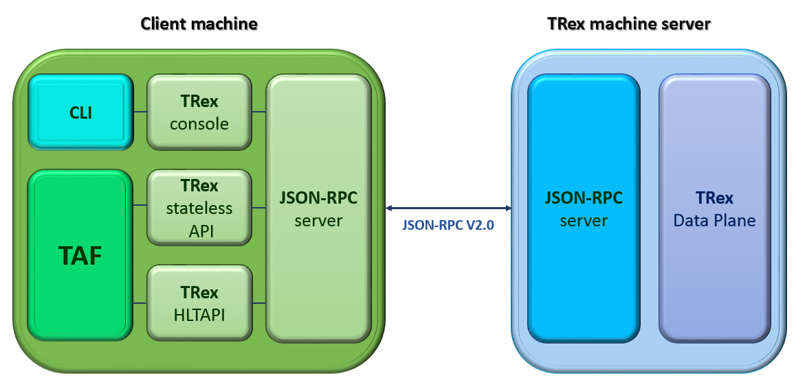
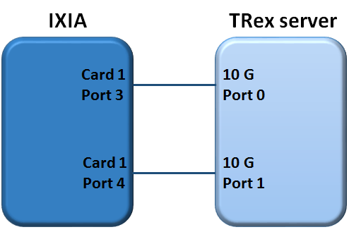

Test execution
==============

Launch Examples
^^^^^^^^^^^^^^^

Test cases can be run with supplying of `py.test <http://doc.pytest.org/en/latest>`_ options:

1. All standard **py.test** options can be used for performing test cases.
2. General TAF specific options.
3. Additional ons-specific options.
4. Options provided by plugins.

It’s easy to get all the information with short description using the command shown below:

.. code-block:: console

   $ py.test --help

General Options:
++++++++++++++++
These options have to be registered in top level `conftest.py <http://doc.pytest.org/en/latest/writing_plugins.html?highlight=conftest#conftest-py-plugins>`_ file and they are checked by **testlib** modules.

+------------------------------------+----------------------------------------------------------------------------+
|``--env=ENV``                       |setting environment option, identify devices, *'None'*  by default          |
+------------------------------------+----------------------------------------------------------------------------+
|``--setup_file=SETUP``              |environment setup option, define environment configurations,                |
|                                    |*'sim_lxc_simplified.json'* by default                                      |
+------------------------------------+----------------------------------------------------------------------------+
|``--loglevel=LOGLEVEL``             |logging level, print logging to console. *'INFO'* by default                |
+------------------------------------+----------------------------------------------------------------------------+
|``--logfile=LOGFILE``               |logging file, store logs into file. *'None'* by default                     |
+------------------------------------+----------------------------------------------------------------------------+
|``--silent``                        |do not print logging to console. *Default* - Disabled                       |
+------------------------------------+----------------------------------------------------------------------------+
|``--get_only``                      |do not start environment, only connect to exists one. *False* by default    |
+------------------------------------+----------------------------------------------------------------------------+
|``--leave_on``                      |do not shutdown environment after the end of tests. *False* by default      |
+------------------------------------+----------------------------------------------------------------------------+
|``--use_parallel_init``             |threads for simultaneous devices processing. *False* by default             |
+------------------------------------+----------------------------------------------------------------------------+

.. note::

   option --setup_file are obligatory

Additional Options:
+++++++++++++++++++
These options are described and analyzed in top level `conftest.py <http://doc.pytest.org/en/latest/writing_plugins.html?highlight=conftest#conftest-py-plugins>`_ files.

+--------------------------------------+----------------------------------------------------------------------------------------------------------+
|``--setup_scope=SETUP_SCOPE``         |setup scope, select from 'session', 'module', 'class', 'function'. *'module'* by default                  |
|                                      |                                                                                                          |
+--------------------------------------+----------------------------------------------------------------------------------------------------------+
|``--call_check=CALL_CHECK``           |check method for devices on test case call (`none|complete|fast|sanity_check_only`) *'fast'* by default   |
|                                      |                                                                                                          |
+--------------------------------------+----------------------------------------------------------------------------------------------------------+
|``--teardown_check=TEARDOWN_CHECK``   |check method for devices on test case teardown  (`none|complete|fast|sanity_check_only`)                  |
|                                      |*'sanity_check_only'* by default                                                                          |
+--------------------------------------+----------------------------------------------------------------------------------------------------------+

ONS-specific Options:
+++++++++++++++++++++
This options are analyzed in ONS specific **teslib** modules (e.g. switches module).

+------------------------------------+-------------------------------------------------------------------------------------------------------------------------------------+
|``--fail_ctrl=FAIL_CTRL``           |action on device failure (`stop|restart|ignore`). *'restart'* by default                                                             |
+------------------------------------+-------------------------------------------------------------------------------------------------------------------------------------+
|``--build_path``                    |BUILD_PATH Path to build, *'/opt/simswitch'* by default                                                                              |
+------------------------------------+-------------------------------------------------------------------------------------------------------------------------------------+
|``--testenv``                       |{none, simplified2, simplified3, simplified4, simplified5, golden, diamond, mixed}                                                   |
|                                    |Verify environment before starting tests (`none | simplified2 | simplified3 | simplified4 | simplified2 | golden | diamond | mixed`) |
|                                    |*'none'* by default                                                                                                                  |
+------------------------------------+-------------------------------------------------------------------------------------------------------------------------------------+

Plugin Options:
+++++++++++++++
These options are provided by plugins.

+--------------------------------+------------------------------------------------------------------------------+
|``--pidcheck_disable``          |disable pid check for test                                                    |
+--------------------------------+------------------------------------------------------------------------------+
|``--log_storage``               |{none, host, tms, both} where to store run logs (`none | host | tms | both`)  |
+--------------------------------+------------------------------------------------------------------------------+
|``--log_type``                  |{Failed, All} what kind of tests logs to store (`Failed | All`).              |
|                                |*'Failed'* by default                                                         |
+--------------------------------+------------------------------------------------------------------------------+
|``--log_enable``                |{False, True} enable/disable log tool for test (`False | True`).              |
|                                |*False* by default                                                            |
+--------------------------------+------------------------------------------------------------------------------+

You can **execute** the test cases using the following command:

.. code-block:: bash

   /<host>/:~ /testcases$ sudo env PYTHONPATH=~taf/taf py.test --env=config/env/environment_examples.jso --setup=config/setup/rr_simplified.json general/test_switch.py -m sanity --logdir=demo_logs --xml_html=demo.html

+---------------------+----------------------------------------------------------------------------------------------------------------------------------------------------------------------------------------+
|``env PYTHONPATH``   |set up PYTHONPATH variable                                                                                                                                                              |
+---------------------+----------------------------------------------------------------------------------------------------------------------------------------------------------------------------------------+
|``env``              |provide path to the `environment*.json <http://sphinx-docs-creation.readthedocs.io/en/latest/test_execution_preconfiguration.html#environment-config-testcases-config-env-json>`_  file |
+---------------------+----------------------------------------------------------------------------------------------------------------------------------------------------------------------------------------+
|``setup``            |provide path to the `setup*.json <http://sphinx-docs-creation.readthedocs.io/en/latest/test_execution_preconfiguration.html#setup-config-testcases-config-setup-json>`_  file           |
+---------------------+----------------------------------------------------------------------------------------------------------------------------------------------------------------------------------------+

Test cases with traffic generators
^^^^^^^^^^^^^^^^^^^^^^^^^^^^^^^^^^
Traffic generator is necessary to transmit and receive network traffic packets through the switch systems.

For the first you need to install 3rd party packages for Traffic Generator.

Installing 3rd party packages for IXIA traffic generator
++++++++++++++++++++++++++++++++++++++++++++++++++++++++
**IxTclHal API**

TAF might require an IXIA TCL hal library and Python bindings for Tcl available in the Tkinter library depending on test scenarios. Ixia is one of traffic generators which generate traffic, or monitor the traffic transmitted by peers such as a switch. The latest Ixia software can be downloaded from Ixia website with eligible account.

Install Python Tk library:

.. code-block:: console

   $ sudo apt-get install python-tk

Get the IxOS binary (version X.XX) and install it (into **/opt** folder):

.. code-block:: console

   $ chmod +x ixosX.XX.XXX.XLinux.bin
   $ sudo ./ixosX.XX.XXX.XLinux.bin

* Select Tcl version: **Tcl8.4**
* Choose install folder: **/opt/ixos**

Add symlink to **/opt/ixos/lib/ixTcl1.0** directory into **/usr/share/tcltk/tcl8.4/**:

.. code-block:: console

   $ sudo ln -s /opt/ixos/lib/ixTcl1.0 /usr/share/tcltk/tcl8.4/

Check if IXIA library was installed properly:

.. code-block:: console

   $ env IXIA_VERSION=X.XX tclsh
   % package req IxTclHal
   Tcl Client is running Ixia Software version: X.XX
   X.XX

.. note::

   Add "export IXIA_VERSION=X.XX" to your /etc/profile if necessary

*Possible issues:*

* Can't create directory **/opt/ixos/Logs**. Permission denied - create necessary directories manually with sudo:

.. code-block:: console

   $ sudo mkdir /opt/ixos/Logs && sudo mkdir /opt/ixos/Results

* In case you're getting  'Segmentation fault'  error - reinstall Tcl:

.. code-block:: console

   $ sudo apt-get purge tcl8.4
   $ sudo apt-get install tcl

**IxNetwork and HLTAPI**

New (IxNetwork) API requires additional steps to be performed, as described in this section.

**Install IxNetwork Tcl Client**

Get the IxOS binary (version X.XX or better X.XX) and Install it:

.. code-block:: console

   $ chmod +x IxNetworkTclClientX.X.XXX.XXLinux.bin
   $ sudo ./IxNetworkTclClientX.X.XXX.XXLinux.bin

.. note::

   Install the client software where IxOS is already installed!

IxNetwork adds environment variables into **/etc/profile**, so reload profiles:

.. code-block:: console

   $ source /etc/profile && source ~/.bashrc

How to check that IxNetwork Tcl Client has been installed properly:

.. code-block:: console

   $ /opt/ixos/bin/ixnetwish
   % package req ix_tc
   3.20
   % package req tbcload
   1.4
   % package req Thread
   2.6.5
   %

**Configure HLTAPI**

Install additional tcl pckages:

.. code-block:: console

   $ sudo apt-get install tcl8.4 tclx8.4

.. note::

   HLTAPI can work properly only under tcl8.4

Check if configuration is correct:

.. code-block:: console

   $ env IXIA_VERSION=X.XX tclsh
   % package req Ixia
   Tcl X.X is installed on 64bit architecture.
   Using products based on HLTSET138
   Tcl Client is running Ixia Software version: X.XX
   Loaded IxTclHal X.XX
   Loaded IxTclServices X.XX
   Loaded IxTclProtocol X.XX.XXX.XX
   Loaded IxTclNetwork X.X.XXX.XX
   HLT release X.XX.X.XXX
   Loaded ixia_hl_lib-X.X
   X.XX
   %

**IxLoad**

Install IxLoad libraries to the same location with IxTclClient:

.. code-block:: console

   $ chmod +x IxLoadTclApiX.XX.XX.XLinux.bin
   $ sudo ./IxLoadTclApiX.XX.XX.XLinux.bin
   $ source /etc/profile && source ~/.bashrc

Check if IxLoad installed correctly:

.. code-block:: console

   $ env IXIA_VERSION=X.XX tclsh
   % package req IxLoad
   Tcl Client is running Ixia Software version: X.XX
   X.XX.XX.X

Installing 3rd party packages for TRex traffic generator
++++++++++++++++++++++++++++++++++++++++++++++++++++++++
**TAF and TRex control plane**

**Download and installation TRex server**

* Check environment:

  * hardware recommendation
  * supported Linux versions:

        * Fedora 18-21, 64-bit kernel (not 32-bit)
        * Ubuntu 16.04 LTS, 64-bit kernel (not 32-bit)

* Obtain the TRex package. Latest release:

.. code-block:: console

   $ mkdir trex
   $ cd trex
   $ wget --no-cache http://trex-tgn.cisco.com/trex/release/latest
   $ tar -xzvf latest

To obtain a specific version(X.XX=Version number):

.. code-block:: console

   $ wget --no-cache http://trex-tgn.cisco.com/trex/release/vX.XX.tar.gz

**Run TRex server**

* Identify the ports:

.. code-block:: console

   $ cd trex
   $ sudo ./dpdk_setup_ports.py –s

* Create simple configuration file:

  * Copy a basic configuration file from cfg folder:

  .. code-block:: console

     $ cp  cfg/simple_cfg.yaml /etc/trex_cfg.yaml

  * Edit the configuration file:

  .. code-block:: yaml

     $ vim  /etc/trex_cfg.yaml
     port_limit      : 2         # this option can limit the number of port of the platform
     version         : 2
     interfaces      : ["03:00.0","03:00.1"] #the interfaces using ./dpdk_setup_ports.py –s

* Run TRex for the first time:

  Use the following command to begin operation of a 2x10Gb/sec TRex:

  .. code-block:: console

     $ sudo ./t-rex-64 -i -c 2 –cfg /etc/ trex_cfg.yaml

**Download and installation Client Machine**

* Obtain the TRex client package:

  Latest release:

  .. code-block:: console

     $ mkdir trex_client
     $ cd trex_client
     $ wget --no-cache http://trex-tgn.cisco.com/trex/release/latest
     $ tar -xzvf latest
     $ cd vX.XX
     # X.XX=Version number
     $ tar -xzvf trex_client_v2.03.tar.gz

* Clone TAF and TCs repositories:

.. code-block:: console

   $ git clone https://github.com/taf3/taf.git
   $ git clone https://github.com/taf3/testcases.git

* Create setup file and update env file based on diagram bellow:

**TRex config in ENV JSON file**:

.. code-block:: json
   :linenos:

   {"name": "TRex", "entry_type": "tg", "instance_type": "trex", "id": "1001", "ipaddr": "X.X.X.X", "ssh_user": "",  "ssh_pass": "", "ports": [0, 1]}

**TRex setup file**:

.. code-block:: json
   :linenos:

    {"env": [
            {"id": "02", "port_list": [[[1, 1, 3], 10000], [[1, 1, 4], 10000]]},
            {"id": "1001"},
            {"id": "5", "related_id": ["02", "1001"]}],
    "cross": { "5": [["02",1,"1001",1], ["02",2,"1001",2]] }}

Traffic Generator attributes and methods
^^^^^^^^^^^^^^^^^^^^^^^^^^^^^^^^^^^^^^^^
All traffic generator objects have to be child of interface class **testlib::tg_template::GenericTG**.

Please read reference above for all available methods.

.. note::

   Support of some methods could be unavailable in some tg types

Sniffing
++++++++
Usage example:

.. code-block:: python
   :linenos:

    tg_ports = [ports[('tg1', 'sw1')][1], ports[('tg1', 'sw1')][2]]
    env.tg[1].start_sniff(tg_ports, sniffing_time=10, filter_layer="STP")
    #...
    # Other steps in case
    #...
    data = env.tg[1].stop_sniff(tg_ports)

**Description/Features**

* Sniffing is performed in background.
* Stop_sniff() can be called separately for each port.
* Real packets capturing could be started with some delay. We found that different sniffer types don't start capturing right after receiving the command but with some delay. Based on experience this delay is set to 1.5 seconds. Therefore additional time sleep 1.5 seconds is introduced in start_sniff method, which are included in sniffing_time. You have to take this in to account and don't use sniffing time less then 3 seconds (5 is recommended). For benchmarking test cases you have to use special environment like IxNetwork or IxLoad.
* You can stop sniffers immediately using force=True parameter. By default stop_sniff returns control only after sniffing_time is elapsed.

**Full methods references**

* testlib::tg_template::GenericTG::start_sniff
* testlib::tg_template::GenericTG::stop_sniff

Packets filtering
+++++++++++++++++
You can check list of run-time filter layers in tg object attribute flt_patterns (testlib::packet_processor::PacketProcessor::flt_patterns).

If you need more complicated filter condition you should use post processing:

.. code-block:: python
   :linenos:

    lfilter = lambda x: x.haslayer("STP") and x.get_lfield("STP", "rootid") == 4096
    data1 = {}
    for key in data.keys():
        data1[key] = filter(lfilter, data[key])

This filter returns the selection of STP BPDU packets with the rootid field equal to 4096.

Using comprehensive lists, the previous example becomes:

.. code-block:: python
   :linenos:

    lfilter = lambda x: x.haslayer("STP") and x.get_lfield("STP", "rootid") == 4096
    data1 = dict((key, filter(lfilter, data[key])) for key in data.keys())

Sending Packets
+++++++++++++++

**Trivial Packet Sending**

Method **send_stream()** returns control after packet sending is finished:

.. code-block:: python
   :linenos:

    tg_port = ports[('tg1', 'sw1')][1]
    stream_id = env.tg[1].set_stream(packet_definition, count=5, inter=2, iface=tg_port)
    env.tg[1].send_stream(stream_id)

.. note::

   You should define streams at the beginning of the test case if possible. Then in steps, use only the send_stream method. This manner of packet sending improves test case performance as far as setting stream takes additional time for execution

**Threaded Packet Sending**

Method **start_streams()** returns control immediately after call. Packets will be sent in the background:

.. code-block:: python
   :linenos:

    tg_port = ports[('tg1', 'sw1')][1]
    stream_id_1 = env.tg[1].set_stream(packet_definition_1, count=5, inter=2, iface=tg_port)
    stream_id_2 = env.tg[1].set_stream(packet_definition_2, count=15, inter=1, iface=tg_port)
    env.tg[1].start_streams([stream_id_1, stream_id_2, ])
    #...
    # Some staff
    #...
    env.tg[1].stop_streams([stream_id_1, stream_id_2, ])

.. warning::

   If you'll try to start another stream without stopping the previous one, the first streams will be re-started. This behavior depends on TG type. Don't use it as a feature

The **set_stream()** method has several parameters that allow you to build a packet stream with incremented parameters.

**Full methods references**

* testlib::tg_template::GenericTG::set_stream
* testlib::tg_template::GenericTG::send_stream
* testlib::tg_template::GenericTG::start_streams
* testlib::tg_template::GenericTG::stop_streams

Working with Packets
++++++++++++++++++++

Traffic Generator objects include set of methods to work with packets (please see testlib::packet_processor::PacketProcessor). But you also can access packet fields directly using internal packet's methods.

*Get Packet Field*

* TG method
    * testlib::packet_processor::PacketProcessor::get_packet_field()

*Get Packet Layer in Necessary Format*

* TG method
    * testlib::packet_processor::PacketProcessor::get_packet_layer()

*Check packet field value*

* TG method
    * testlib::packet_processor::PacketProcessor::check_packet_field()
    * testlib::packet_processor::PacketProcessor::check_packet_field_multilayer()

*Get packet dictionary*

Reverse packet building: pypacker packet to packet dictionary.

* TG method
    * testlib::packet_processor::PacketProcessor::packet_dictionary()

*Packet fragmenting and assembling*

* TG method
    * testlib::packet_processor::PacketProcessor::packet_fragment
    * testlib::packet_processor::PacketProcessor::assemble_fragmented_packets

Statistics
++++++++++

Traffic Generator object contains number of methods to work with statistics.

* testlib::tg_template::GenericTG::clear_statistics()
* testlib::tg_template::GenericTG::get_sent_frames_count()
* testlib::tg_template::GenericTG::get_received_frames_count()
* testlib::tg_template::GenericTG::get_filtered_frames_count()
* testlib::tg_template::GenericTG::get_uds_3_frames_count()
* testlib::tg_template::GenericTG::get_qos_frames_count()

.. note::

   Different types of TG could don't have support of some counters. Read appropriate tg type docs

Example of the test case with traffic generator
^^^^^^^^^^^^^^^^^^^^^^^^^^^^^^^^^^^^^^^^^^^^^^^
*Sample Test*:

.. code-block:: python
   :linenos:

    class TestLinks(object):

        def test_links(self, env):
            """ Test links between Trex TG and IXIA"""
            # Define TGs
            ixia = env.tg[1].id
            trex = env.tg[2].id
            # Define active ports and packet
            ports = env.get_ports()
            packet_definition = (
                 {"Ethernet": {"dst": "ff:ff:ff:ff:ff:ff",
                               "src": "00:00:00:00:00:02"}},
                 {"IP": {"src": 'X.X.X.X', "dst": 'X.X.X.X'}})
            packet_count = 1
            # Set traffic stream on TRex
            stream_id = env.tg[2]. sey_stream(
                       packet_definition,
                       count=packet_count,
                       iface=ports[(trex, ixia)][1],
                       adjust_size=True)
            # Start sniff on Ixia
            env.tg[1].start_sniff([ixia, trex)][1])
            # Send packet
            env.tg[2].start_streams([stream_id])
            time.sleep(1)
            # Stop sniff
            data = env.tg[1].stop_sniff([ports[(ixia, trex)][1]])
            # Verify that packet was received
            assert len(data[ports[(ixia, trex)][1]]) == 1

Example TAF command line, run in the testcase directory:

.. code-block:: bash

    $ env PYTHONPATH=../taf/taf:<path to Trex client library  /trex_client/stl/ or use $TREX_CLIENT_LIB> py.test --env=config/env/environment_examples.json --setup=config/setup/trex_ixia_simplified.json testcases/test_links.py --loglevel=DEBUG

